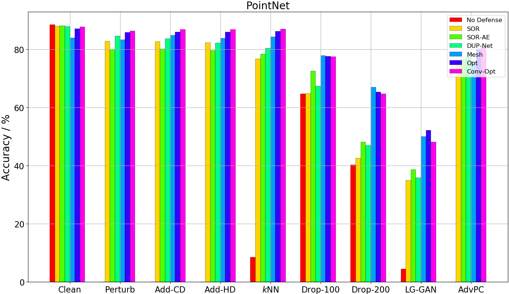
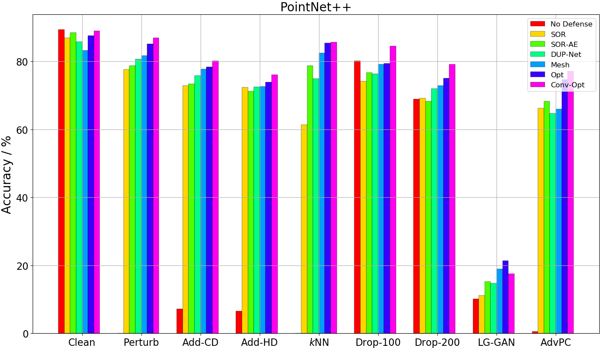

# IF-Defense

This repository is the official PyTorch implementation of [IF-Defense: 3D Adversarial Point Cloud Defense via Implicit Function based Restoration]().

## Introduction

Point cloud is an important 3D data representation widely used in many essential applications (e.g. autonomous driving, robotics). Leveraging deep neural networks (DNNs), recent works have shown great success in processing 3D point clouds. However, DNNs are vulnerable to adversarial attacks, bringing security threat to those safety-critical applications.

Although adversarial attack and defense are widely studied in 2D images, little attention is paid to its 3D counterpart. In this paper, we show that 3D attack is not a simple extension of 2D. We summarize the attack effects of existing methods from a **3D-specific geometric-aware perspective**. The small and local perturbations are *point perturbation*, which includes **out-of-surface perturbation** and **on-surface perturbation**. The larger and more global attacks are *surface distortion* including **local part removal** and **geometric deformation**.

<center></center>
In this paper, we propose a novel 3D adversarial point cloud defense method leveraging **implicit function** based restoration. It is composed of two steps: 1) it predicts an implicit function that captures the *clean shape* through a surface recovery module, and 2) restores a clean and complete point cloud via *optimizing* towards the predicted implicit surface under geometry- and distribution- aware constraints. Our experimental results show that IF-Defense achieves the state-of-the-art defense performance against all existing adversarial attacks on PointNet, PointNet++, DGCNN and PointConv.

<center></center>
In this repo, we provide PyTorch implementations for baseline attacks (Perturb, Add, kNN, Drop), defenses (SRS, SOR, DUP-Net) and three variants of IF-Defense (ONet-Mesh, ONet-Opt, ConvONet-Opt). We hope this open source codebase can benefit the community of 3D adversarial attack and defense in point cloud.

## Requirements

Our project is developed using Python 3.7.7, PyTorch 1.5.0 with CUDA10.1. We recommend you to use [anaconda](https://www.anaconda.com/) for dependency configuration.

First create an anaconda environment called ```IF-Defense``` by

```shell
conda create -n IF-Defense python=3.7
conda activate IF-Defense
```

All the required packages are listed in the requirements.txt file. First use pip to install them by

```shell
python -m pip install -r requirements.txt
```

Then, you need to install torch, torchvision and torch-scatter manually to fit in with your server environment (e.g. CUDA version). For the torch and torchvision used in my project, run

```shell
conda install pytorch==1.5.0 torchvision==0.6.0 cudatoolkit=10.1 -c pytorch
```

For torch-scatter (used in ConvONet), please follow [their official instruction](https://github.com/rusty1s/pytorch_scatter).

## Project Structure

The code in this project is mainly divided into three folders, each of which has a detailed README file explaining its usage. Here I will briefly outline the structure of this repo.

```baselines/``` contains code for training/testing the victim models as well as some baseline attack and defense methods.

```ONet/``` implements two variants of our IF-Defense, **ONet-Mesh** and **ONet-Opt**.

```ConvONet/``` is another variant (and also the strongest in most cases) of IF-Defense, **ConvONet-Opt**.

Please go to each folder to see how to use the code in detail.

## Results

### Quantitative Results

The comprehensive comparisons between different defense methods against various attacks on four victim models can be found in the paper (Table.2, 3, 4, 5). Here we plot the results as histograms for more straightforward demonstration, where the x-axis are different attacks, y-axis is accuracy and higher is better and our IF-Defense is the last three columns of each cluster.

**Note that, the last three columns are three variants of our methods.**

<center></center>
<center></centercenter>

<center></center>
<center></center>

### Qualitative Results

We show defense point clouds of SOR, DUP-Net and three variants of IF-Defense. Our methods successfully 1) **recover** the head of the airplane under point dropping attack and 2) **restore** uniform point distributions under kNN attack. More visualizations can be found in the appendix of the paper.

<center></center>


## License

IF-Defense is released under the MIT License. See the LICENSE file for more details.

## Acknowledgements

We thank the authors of following works for opening source their excellent codes.

- [PointNet/PointNet++](https://github.com/yanx27/Pointnet_Pointnet2_pytorch), [DGCNN](https://github.com/WangYueFt/dgcnn), [PointConv](https://github.com/DylanWusee/pointconv_pytorch)
- [Perturb/Add attack](https://github.com/xiangchong1/3d-adv-pc), [kNN attack](https://github.com/jinyier/ai_pointnet_attack), [Drop attack](https://github.com/tianzheng4/PointCloud-Saliency-Maps)
- [PU-Net](https://github.com/lyqun/PU-Net_pytorch), [DUP-Net](https://github.com/RyanHangZhou/DUP-Net)
- [ONet](https://github.com/autonomousvision/occupancy_networks), [ConvONet](https://github.com/autonomousvision/convolutional_occupancy_networks)

We also thank the authors of related papers/repos for their inspiring discussions with us.

## Contact

If you have any questions about the paper or the code, please contact Ziyi Wu wuzy17@mails.tsinghua.edu.cn

